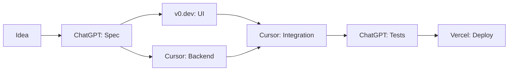

# 🔗 Integration Guide: Combining Free AI Tools

> Learn how to integrate multiple free AI tools to create powerful workflows

---

## 📑 Table of Contents

- [Integration Patterns](#-integration-patterns)
- [Developer Workflows](#-developer-workflows)
- [Content Creation Pipelines](#-content-creation-pipelines)
- [Design Systems](#-design-systems)
- [Research & Analysis](#-research--analysis)
- [API Integration Examples](#-api-integration-examples)
- [Automation Scripts](#-automation-scripts)

---

## 🔄 Integration Patterns

### Pattern 1: Sequential Processing

**Concept:** Output of Tool A → Input to Tool B → Final Result

**Example:** Blog Post to Social Media

```
ChatGPT (write blog)
  → Copy.ai (create social captions)
  → Leonardo AI (generate images)
  → Canva (design posts)
```

### Pattern 2: Parallel Processing

**Concept:** Multiple tools working simultaneously

**Example:** Multi-Platform Content

```
Input: Product description
├─ ChatGPT → Blog post
├─ Leonardo AI → Product images
├─ ElevenLabs → Audio description
└─ Runway ML → Product video
```

### Pattern 3: Fallback Chain

**Concept:** Use Tool B if Tool A fails or hits limits

**Example:** Chat Fallback

```
Try ChatGPT → If rate limited → Use Claude → If limited → Use Gemini
```

### Pattern 4: Aggregation

**Concept:** Combine outputs from multiple tools

**Example:** Research Synthesis

```
Perplexity AI → Summary A
Consensus → Summary B
Elicit → Summary C
  → Claude → Combined analysis
```

---

## 💻 Developer Workflows

### Workflow 1: Full-Stack Development Pipeline

**Tools:**

- Planning: ChatGPT/Claude
- UI Design: v0.dev
- Coding: Cursor/GitHub Copilot
- Testing: ChatGPT
- Deployment: Vercel/Netlify (free tier)

**Integration:**



**Step-by-Step:**

1. **Generate Specification**

```bash
# Use ChatGPT
Prompt: "Create a technical spec for [app idea]
Include: Tech stack, database schema, API endpoints, components"

# Save output to: docs/spec.md
```

2. **Generate UI Components**

```bash
# Use v0.dev
Prompt: "Create [component] based on this spec: [paste spec]"

# Copy generated code to: src/components/
```

3. **Implement Backend**

```bash
# Use Cursor
# Open Cursor → Cmd/Ctrl + K
Prompt: "Implement API endpoints from spec.md
Use Express.js and Prisma"

# Cursor generates code in real-time
```

4. **Integrate & Test**

```bash
# Use GitHub Copilot in Cursor
# Type comment: "// Test for user authentication"
# Copilot generates test code

# Run tests
npm test
```

5. **Deploy**

```bash
# Connect to Vercel
vercel login
vercel deploy

# Free tier: Unlimited deployments
```

---

### Workflow 2: AI-Powered Code Review System

**Tools:**

- Claude (code analysis)
- GitHub Actions (automation)
- Cursor (refactoring)

**Integration:**

```yaml
# .github/workflows/ai-review.yml
name: AI Code Review

on: [pull_request]

jobs:
  review:
    runs-on: ubuntu-latest
    steps:
      - uses: actions/checkout@v2

      - name: AI Code Review
        run: |
          # Get changed files
          git diff origin/main...HEAD > changes.diff

          # Send to Claude API for review
          curl -X POST https://api.anthropic.com/v1/messages \
            -H "x-api-key: ${{ secrets.CLAUDE_API_KEY }}" \
            -H "content-type: application/json" \
            -d '{
              "model": "claude-3-5-sonnet-20241022",
              "max_tokens": 1024,
              "messages": [{
                "role": "user",
                "content": "Review this code diff: $(cat changes.diff)"
              }]
            }'
```

**Benefits:**

- Automated code review on every PR
- Catches bugs before merge
- Free tier: ~1000 reviews/month

---

### Workflow 3: Multi-Model API Router

**Concept:** Route requests to different free AI APIs based on task type

**Tools:**

- Google Gemini (free, fast)
- Groq (free, very fast)
- Hugging Face (free, specialized models)

**Implementation:**

```javascript
// ai-router.js
import { GoogleGenerativeAI } from "@google/generative-ai";
import Groq from "groq-sdk";
import { HfInference } from "@huggingface/inference";

class AIRouter {
  constructor() {
    this.gemini = new GoogleGenerativeAI(process.env.GEMINI_API_KEY);
    this.groq = new Groq({ apiKey: process.env.GROQ_API_KEY });
    this.hf = new HfInference(process.env.HF_TOKEN);
  }

  async route(task, input) {
    switch (task) {
      case "chat":
        // Use Groq for fast chat responses
        return await this.groqChat(input);

      case "long-context":
        // Use Gemini for long context (1M tokens)
        return await this.geminiChat(input);

      case "code":
        // Use Groq with CodeLlama
        return await this.groqCode(input);

      case "image-caption":
        // Use Hugging Face BLIP model
        return await this.hfImageCaption(input);

      default:
        // Default to Gemini (most generous free tier)
        return await this.geminiChat(input);
    }
  }

  async groqChat(message) {
    const completion = await this.groq.chat.completions.create({
      messages: [{ role: "user", content: message }],
      model: "mixtral-8x7b-32768",
      temperature: 0.7,
    });
    return completion.choices[0].message.content;
  }

  async geminiChat(message) {
    const model = this.gemini.getGenerativeModel({
      model: "gemini-1.5-flash",
    });
    const result = await model.generateContent(message);
    return result.response.text();
  }

  async groqCode(code) {
    const completion = await this.groq.chat.completions.create({
      messages: [
        {
          role: "user",
          content: `Explain this code:\n\n${code}`,
        },
      ],
      model: "llama-3.1-70b-versatile",
    });
    return completion.choices[0].message.content;
  }

  async hfImageCaption(imageUrl) {
    const result = await this.hf.imageToText({
      data: await fetch(imageUrl).then((r) => r.blob()),
      model: "Salesforce/blip-image-captioning-base",
    });
    return result.generated_text;
  }
}

// Usage
const router = new AIRouter();

// Fast chat
const response1 = await router.route("chat", "Hello!");

// Long document analysis
const response2 = await router.route("long-context", longDocument);

// Code explanation
const response3 = await router.route("code", codeSnippet);

// Image captioning
const response4 = await router.route("image-caption", imageUrl);
```

**Benefits:**

- Maximize free tier usage
- Automatic failover
- Task-optimized routing
- Cost: $0/month

---

## 🎨 Content Creation Pipelines

### Pipeline 1: Blog Post to Multi-Platform Content

**Tools:**

- ChatGPT (writing)
- Leonardo AI (images)
- ElevenLabs (audio)
- Descript (video)
- Canva (social media)

**Automation Script:**

```javascript
// content-pipeline.js
import OpenAI from "openai";
import { ElevenLabsClient } from "elevenlabs";
import axios from "axios";

class ContentPipeline {
  constructor() {
    this.openai = new OpenAI({ apiKey: process.env.OPENAI_API_KEY });
    this.elevenlabs = new ElevenLabsClient({
      apiKey: process.env.ELEVENLABS_API_KEY,
    });
  }

  async createBlogPost(topic) {
    // Step 1: Generate blog post
    const blogPost = await this.generateBlog(topic);

    // Step 2: Create social media versions
    const socialPosts = await this.createSocialPosts(blogPost);

    // Step 3: Generate images
    const images = await this.generateImages(topic);

    // Step 4: Create audio version
    const audio = await this.createAudio(blogPost);

    return {
      blog: blogPost,
      social: socialPosts,
      images: images,
      audio: audio,
    };
  }

  async generateBlog(topic) {
    const response = await this.openai.chat.completions.create({
      model: "gpt-3.5-turbo",
      messages: [
        {
          role: "user",
          content: `Write a 1000-word blog post about: ${topic}
        Include:
        - Engaging introduction
        - 3 main sections
        - Conclusion with CTA
        - SEO-optimized`,
        },
      ],
    });
    return response.choices[0].message.content;
  }

  async createSocialPosts(blogPost) {
    const response = await this.openai.chat.completions.create({
      model: "gpt-3.5-turbo",
      messages: [
        {
          role: "user",
          content: `Convert this blog post to social media posts:
        ${blogPost}
        
        Create:
        1. Twitter thread (5 tweets)
        2. LinkedIn post
        3. Instagram caption
        4. Facebook post
        
        Include relevant hashtags`,
        },
      ],
    });
    return response.choices[0].message.content;
  }

  async generateImages(topic) {
    // Use Leonardo AI API or DALL-E
    const response = await this.openai.images.generate({
      model: "dall-e-3",
      prompt: `Professional blog header image for: ${topic}`,
      n: 1,
      size: "1792x1024",
    });
    return response.data[0].url;
  }

  async createAudio(text) {
    // Use ElevenLabs for text-to-speech
    const audio = await this.elevenlabs.generate({
      voice: "Rachel",
      text: text,
      model_id: "eleven_monolingual_v1",
    });
    return audio;
  }
}

// Usage
const pipeline = new ContentPipeline();
const content = await pipeline.createBlogPost("AI in Healthcare");

console.log("Blog:", content.blog);
console.log("Social Posts:", content.social);
console.log("Images:", content.images);
console.log("Audio:", content.audio);
```

**Output:**

- 1 blog post
- 4 social media versions
- 1 header image
- 1 audio version
- Total time: ~5 minutes
- Total cost: ~$0.10 (if using paid APIs) or $0 (using free tiers)

---

### Pipeline 2: Video Content Factory

**Tools:**

- ChatGPT (script)
- ElevenLabs (voiceover)
- Runway ML (video clips)
- Descript (editing)
- OpusClip (shorts)

**Workflow:**

```bash
# 1. Generate script
echo "Topic: AI Tools" | chatgpt-cli > script.txt

# 2. Create voiceover
elevenlabs-cli --text "$(cat script.txt)" --voice Rachel > voiceover.mp3

# 3. Generate video clips (manual via Runway ML)
# Use prompts from script

# 4. Edit in Descript
# Import voiceover.mp3 and video clips
# Edit by editing transcript

# 5. Create shorts with OpusClip
# Upload final video
# AI finds best moments
```

**Automation with Python:**

```python
# video_factory.py
import openai
import requests
import os

class VideoFactory:
    def __init__(self):
        self.openai_key = os.getenv("OPENAI_API_KEY")
        self.elevenlabs_key = os.getenv("ELEVENLABS_API_KEY")

    def create_video_content(self, topic):
        # Step 1: Generate script
        script = self.generate_script(topic)

        # Step 2: Create voiceover
        audio_url = self.create_voiceover(script)

        # Step 3: Generate video prompts
        prompts = self.generate_video_prompts(script)

        return {
            "script": script,
            "audio": audio_url,
            "video_prompts": prompts
        }

    def generate_script(self, topic):
        response = openai.ChatCompletion.create(
            model="gpt-3.5-turbo",
            messages=[{
                "role": "user",
                "content": f"""Write a 2-minute video script about: {topic}
                Include:
                - Hook (first 10 seconds)
                - Main content (3 points)
                - Call to action
                Format: [SCENE] description
                        [VOICEOVER] text"""
            }]
        )
        return response.choices[0].message.content

    def create_voiceover(self, script):
        # Extract voiceover text
        voiceover_text = "\n".join([
            line.replace("[VOICEOVER]", "").strip()
            for line in script.split("\n")
            if "[VOICEOVER]" in line
        ])

        # Call ElevenLabs API
        response = requests.post(
            "https://api.elevenlabs.io/v1/text-to-speech/21m00Tcm4TlvDq8ikWAM",
            headers={
                "xi-api-key": self.elevenlabs_key,
                "Content-Type": "application/json"
            },
            json={
                "text": voiceover_text,
                "model_id": "eleven_monolingual_v1"
            }
        )

        # Save audio file
        with open("voiceover.mp3", "wb") as f:
            f.write(response.content)

        return "voiceover.mp3"

    def generate_video_prompts(self, script):
        # Extract scene descriptions
        scenes = [
            line.replace("[SCENE]", "").strip()
            for line in script.split("\n")
            if "[SCENE]" in line
        ]

        # Generate Runway ML prompts
        prompts = []
        for scene in scenes:
            response = openai.ChatCompletion.create(
                model="gpt-3.5-turbo",
                messages=[{
                    "role": "user",
                    "content": f"""Convert this scene to a Runway ML prompt:
                    {scene}

                    Make it cinematic and detailed."""
                }]
            )
            prompts.append(response.choices[0].message.content)

        return prompts

# Usage
factory = VideoFactory()
content = factory.create_video_content("Future of AI")
print(content)
```

---

## 🎨 Design Systems

### System 1: Automated Brand Asset Generator

**Tools:**

- Leonardo AI (logo concepts)
- Recraft AI (vectors)
- Remove.bg (background removal)
- Canva API (template generation)

**Integration:**

```javascript
// brand-asset-generator.js
import axios from "axios";
import FormData from "form-data";
import fs from "fs";

class BrandAssetGenerator {
  async generateBrandAssets(brandName, description, colors) {
    // Step 1: Generate logo concepts
    const logos = await this.generateLogos(brandName, description);

    // Step 2: Remove backgrounds
    const transparentLogos = await this.removeBackgrounds(logos);

    // Step 3: Create brand templates
    const templates = await this.createTemplates(
      brandName,
      transparentLogos[0],
      colors,
    );

    return {
      logos: transparentLogos,
      templates: templates,
    };
  }

  async generateLogos(brandName, description) {
    // Use Leonardo AI API
    const response = await axios.post(
      "https://cloud.leonardo.ai/api/rest/v1/generations",
      {
        prompt: `Minimalist logo for ${brandName}, ${description}, 
                vector style, professional, modern, white background`,
        num_images: 4,
        width: 1024,
        height: 1024,
        modelId: "6bef9f1b-29cb-40c7-b9df-32b51c1f67d3",
      },
      {
        headers: {
          Authorization: `Bearer ${process.env.LEONARDO_API_KEY}`,
          "Content-Type": "application/json",
        },
      },
    );

    return response.data.generations;
  }

  async removeBackgrounds(images) {
    const results = [];

    for (const image of images) {
      const formData = new FormData();
      formData.append("image_url", image.url);
      formData.append("size", "auto");

      const response = await axios.post(
        "https://api.remove.bg/v1.0/removebg",
        formData,
        {
          headers: {
            "X-Api-Key": process.env.REMOVEBG_API_KEY,
            ...formData.getHeaders(),
          },
          responseType: "arraybuffer",
        },
      );

      const filename = `logo_${Date.now()}.png`;
      fs.writeFileSync(filename, response.data);
      results.push(filename);
    }

    return results;
  }

  async createTemplates(brandName, logoPath, colors) {
    // Use Canva API to create templates
    const templates = [
      "business-card",
      "social-media-post",
      "letterhead",
      "presentation",
    ];

    const results = [];

    for (const template of templates) {
      const design = await axios.post(
        "https://api.canva.com/v1/designs",
        {
          design_type: template,
          title: `${brandName} ${template}`,
          elements: [
            {
              type: "image",
              url: logoPath,
            },
            {
              type: "text",
              text: brandName,
              color: colors.primary,
            },
          ],
        },
        {
          headers: {
            Authorization: `Bearer ${process.env.CANVA_API_KEY}`,
            "Content-Type": "application/json",
          },
        },
      );

      results.push(design.data);
    }

    return results;
  }
}

// Usage
const generator = new BrandAssetGenerator();
const assets = await generator.generateBrandAssets(
  "TechStart",
  "innovative tech startup",
  { primary: "#3B82F6", secondary: "#10B981" },
);

console.log("Generated:", assets);
```

---

## 🔬 Research & Analysis

### Integration: Academic Research Pipeline

**Tools:**

- Perplexity AI (initial research)
- Consensus (academic papers)
- ChatPDF (paper analysis)
- Claude (synthesis)
- Notion API (organization)

**Automation:**

```python
# research_pipeline.py
import requests
import os
from anthropic import Anthropic

class ResearchPipeline:
    def __init__(self):
        self.anthropic = Anthropic(api_key=os.getenv("ANTHROPIC_API_KEY"))
        self.notion_token = os.getenv("NOTION_TOKEN")

    def research_topic(self, topic, num_papers=10):
        # Step 1: Get overview from Perplexity
        overview = self.get_overview(topic)

        # Step 2: Find academic papers
        papers = self.find_papers(topic, num_papers)

        # Step 3: Analyze each paper
        analyses = []
        for paper in papers:
            analysis = self.analyze_paper(paper)
            analyses.append(analysis)

        # Step 4: Synthesize findings
        synthesis = self.synthesize(topic, analyses)

        # Step 5: Save to Notion
        self.save_to_notion(topic, overview, papers, synthesis)

        return {
            "overview": overview,
            "papers": papers,
            "synthesis": synthesis
        }

    def get_overview(self, topic):
        # Use Perplexity API
        response = requests.post(
            "https://api.perplexity.ai/chat/completions",
            headers={
                "Authorization": f"Bearer {os.getenv('PERPLEXITY_API_KEY')}",
                "Content-Type": "application/json"
            },
            json={
                "model": "llama-3.1-sonar-small-128k-online",
                "messages": [{
                    "role": "user",
                    "content": f"Provide an overview of current research on: {topic}"
                }]
            }
        )
        return response.json()["choices"][0]["message"]["content"]

    def find_papers(self, topic, num_papers):
        # Use Consensus API or Semantic Scholar
        response = requests.get(
            f"https://api.semanticscholar.org/graph/v1/paper/search",
            params={
                "query": topic,
                "limit": num_papers,
                "fields": "title,abstract,authors,year,url"
            }
        )
        return response.json()["data"]

    def analyze_paper(self, paper):
        # Use Claude for deep analysis
        message = self.anthropic.messages.create(
            model="claude-3-5-sonnet-20241022",
            max_tokens=1024,
            messages=[{
                "role": "user",
                "content": f"""Analyze this paper:
                Title: {paper['title']}
                Abstract: {paper['abstract']}

                Provide:
                1. Key findings
                2. Methodology
                3. Limitations
                4. Relevance to field"""
            }]
        )
        return message.content[0].text

    def synthesize(self, topic, analyses):
        # Use Claude for synthesis (best for long context)
        all_analyses = "\n\n---\n\n".join(analyses)

        message = self.anthropic.messages.create(
            model="claude-3-5-sonnet-20241022",
            max_tokens=2048,
            messages=[{
                "role": "user",
                "content": f"""Synthesize these paper analyses on {topic}:

                {all_analyses}

                Create a literature review covering:
                1. Common themes
                2. Contradictions
                3. Research gaps
                4. Future directions"""
            }]
        )
        return message.content[0].text

    def save_to_notion(self, topic, overview, papers, synthesis):
        # Create Notion page
        response = requests.post(
            "https://api.notion.com/v1/pages",
            headers={
                "Authorization": f"Bearer {self.notion_token}",
                "Content-Type": "application/json",
                "Notion-Version": "2022-06-28"
            },
            json={
                "parent": {"database_id": os.getenv("NOTION_DATABASE_ID")},
                "properties": {
                    "Name": {"title": [{"text": {"content": topic}}]}
                },
                "children": [
                    {
                        "object": "block",
                        "type": "heading_1",
                        "heading_1": {"rich_text": [{"text": {"content": "Overview"}}]}
                    },
                    {
                        "object": "block",
                        "type": "paragraph",
                        "paragraph": {"rich_text": [{"text": {"content": overview}}]}
                    },
                    {
                        "object": "block",
                        "type": "heading_1",
                        "heading_1": {"rich_text": [{"text": {"content": "Synthesis"}}]}
                    },
                    {
                        "object": "block",
                        "type": "paragraph",
                        "paragraph": {"rich_text": [{"text": {"content": synthesis}}]}
                    }
                ]
            }
        )
        return response.json()

# Usage
pipeline = ResearchPipeline()
results = pipeline.research_topic("AI in Healthcare", num_papers=10)
print(results["synthesis"])
```

---

## 🤖 Automation Scripts

### Script 1: Daily Content Generator

```bash
#!/bin/bash
# daily-content.sh

# Generate daily content using free AI tools

TOPIC="AI News"
DATE=$(date +%Y-%m-%d)

# 1. Research latest news
echo "Researching $TOPIC..."
RESEARCH=$(curl -X POST https://api.perplexity.ai/chat/completions \
  -H "Authorization: Bearer $PERPLEXITY_API_KEY" \
  -H "Content-Type: application/json" \
  -d "{
    \"model\": \"llama-3.1-sonar-small-128k-online\",
    \"messages\": [{
      \"role\": \"user\",
      \"content\": \"What are the top 3 AI news stories today?\"
    }]
  }" | jq -r '.choices[0].message.content')

# 2. Generate blog post
echo "Writing blog post..."
BLOG=$(curl https://api.openai.com/v1/chat/completions \
  -H "Authorization: Bearer $OPENAI_API_KEY" \
  -H "Content-Type: application/json" \
  -d "{
    \"model\": \"gpt-3.5-turbo\",
    \"messages\": [{
      \"role\": \"user\",
      \"content\": \"Write a blog post about: $RESEARCH\"
    }]
  }" | jq -r '.choices[0].message.content')

# 3. Create social posts
echo "Creating social media posts..."
SOCIAL=$(curl https://api.openai.com/v1/chat/completions \
  -H "Authorization: Bearer $OPENAI_API_KEY" \
  -H "Content-Type: application/json" \
  -d "{
    \"model\": \"gpt-3.5-turbo\",
    \"messages\": [{
      \"role\": \"user\",
      \"content\": \"Convert to Twitter thread: $BLOG\"
    }]
  }" | jq -r '.choices[0].message.content')

# 4. Save to files
echo "$BLOG" > "content/$DATE-blog.md"
echo "$SOCIAL" > "content/$DATE-social.md"

echo "Content generated for $DATE"
```

**Schedule with cron:**

```bash
# Run daily at 9 AM
0 9 * * * /path/to/daily-content.sh
```

---

### Script 2: Image Batch Processor

```python
# batch_image_processor.py
import requests
import os
from pathlib import Path

class BatchImageProcessor:
    def __init__(self):
        self.removebg_key = os.getenv("REMOVEBG_API_KEY")
        self.upscale_api = "http://localhost:8080"  # Upscayl local server

    def process_folder(self, input_folder, output_folder):
        """Process all images in folder"""
        input_path = Path(input_folder)
        output_path = Path(output_folder)
        output_path.mkdir(exist_ok=True)

        for image_file in input_path.glob("*.{jpg,png,jpeg}"):
            print(f"Processing {image_file.name}...")

            # Step 1: Remove background
            no_bg = self.remove_background(image_file)

            # Step 2: Upscale
            upscaled = self.upscale_image(no_bg)

            # Step 3: Save
            output_file = output_path / f"processed_{image_file.name}"
            with open(output_file, "wb") as f:
                f.write(upscaled)

            print(f"Saved to {output_file}")

    def remove_background(self, image_path):
        """Remove background using Remove.bg API"""
        with open(image_path, "rb") as f:
            response = requests.post(
                "https://api.remove.bg/v1.0/removebg",
                files={"image_file": f},
                data={"size": "auto"},
                headers={"X-Api-Key": self.removebg_key}
            )
        return response.content

    def upscale_image(self, image_data):
        """Upscale using Upscayl (local)"""
        response = requests.post(
            f"{self.upscale_api}/upscale",
            files={"image": image_data},
            data={"scale": 4}
        )
        return response.content

# Usage
processor = BatchImageProcessor()
processor.process_folder("./input", "./output")
```

---

## 📊 Cost Optimization

### Strategy 1: Free Tier Rotation

```javascript
// free-tier-router.js
class FreeTierRouter {
  constructor() {
    this.usage = {
      chatgpt: { used: 0, limit: 50, reset: Date.now() + 3 * 60 * 60 * 1000 },
      claude: { used: 0, limit: 45, reset: Date.now() + 5 * 60 * 60 * 1000 },
      gemini: { used: 0, limit: Infinity, reset: null },
    };
  }

  async chat(message) {
    // Try ChatGPT first
    if (this.usage.chatgpt.used < this.usage.chatgpt.limit) {
      this.usage.chatgpt.used++;
      return await this.chatGPT(message);
    }

    // Fallback to Claude
    if (this.usage.claude.used < this.usage.claude.limit) {
      this.usage.claude.used++;
      return await this.claude(message);
    }

    // Fallback to Gemini (unlimited)
    this.usage.gemini.used++;
    return await this.gemini(message);
  }

  resetIfNeeded() {
    const now = Date.now();

    if (now >= this.usage.chatgpt.reset) {
      this.usage.chatgpt.used = 0;
      this.usage.chatgpt.reset = now + 3 * 60 * 60 * 1000;
    }

    if (now >= this.usage.claude.reset) {
      this.usage.claude.used = 0;
      this.usage.claude.reset = now + 5 * 60 * 60 * 1000;
    }
  }
}
```

---

## 🎯 Best Practices

### 1. **Error Handling**

```javascript
async function robustAICall(apiCall, maxRetries = 3) {
  for (let i = 0; i < maxRetries; i++) {
    try {
      return await apiCall();
    } catch (error) {
      if (error.status === 429) {
        // Rate limited - wait and retry
        await new Promise((r) => setTimeout(r, 2000 * (i + 1)));
      } else {
        throw error;
      }
    }
  }
  throw new Error("Max retries exceeded");
}
```

### 2. **Caching**

```javascript
const cache = new Map();

async function cachedAICall(prompt, apiCall) {
  if (cache.has(prompt)) {
    return cache.get(prompt);
  }

  const result = await apiCall(prompt);
  cache.set(prompt, result);
  return result;
}
```

### 3. **Batch Processing**

```javascript
async function batchProcess(items, processor, batchSize = 5) {
  const results = [];

  for (let i = 0; i < items.length; i += batchSize) {
    const batch = items.slice(i, i + batchSize);
    const batchResults = await Promise.all(
      batch.map((item) => processor(item)),
    );
    results.push(...batchResults);

    // Rate limiting
    if (i + batchSize < items.length) {
      await new Promise((r) => setTimeout(r, 1000));
    }
  }

  return results;
}
```

---

**Last Updated:** January 2026

> **Pro Tip:** Start with simple integrations and gradually build more complex workflows. Test each integration thoroughly before automating!
